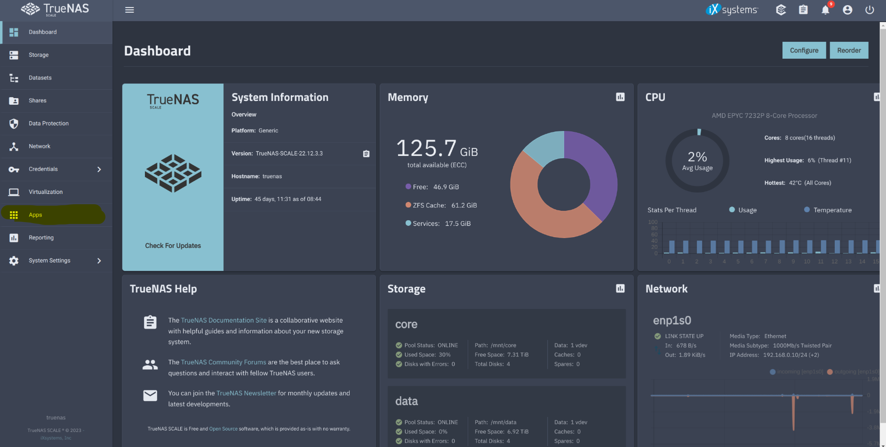
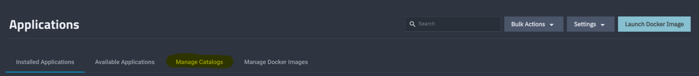

# truenas-install
A step by step guide to installing TrueNAS Scale and TrueCharts.

**TrueNAS Scale**

1. Download the TrueNAS SCALE ISO image from the official website (https://www.truenas.com/download-truenas-scale/).

2. Create a bootable USB drive using the downloaded ISO image. You can use tools like Rufus, UNetbootin, or Etcher to create a bootable USB drive.

3. Insert the bootable USB drive into the computer where you want to install TrueNAS SCALE.

4. Boot the computer from the USB drive. To do this, you may need to enter the BIOS settings and change the boot order to prioritize the USB drive.

5. Once the computer boots from the USB drive, you will see the TrueNAS SCALE installer screen. Select the language and keyboard layout that you want to use.

6. Next, you need to select the disk or disks where you want to install TrueNAS SCALE. You can choose to install on a single disk or set up a RAID array for better data protection.

7. After selecting the disks, you will be prompted to create a root password for the TrueNAS SCALE installation.

8. Once you have set up the root password, the installation process will begin. This may take some time, depending on the speed of your computer and the size of the disks.

9. When the installation is complete, you will be prompted to remove the USB drive and reboot the computer.

10. After the computer reboots, you can access the TrueNAS SCALE web interface by entering the IP address of the computer in a web browser on another device on the same network.

11. The first time you log in to the TrueNAS SCALE web interface, you will be prompted to set up a storage pool and share.

Finally, you can start using TrueNAS SCALE to manage your storage and data.

**TrueCharts**

Adding TrueCharts is easy and requires you add several "trains" of software charts.

1. Select Apps on the left menu

2. Click on Manage Catalogs

3. Click Add Catalog

4. Skip over the iXsystems notice, click Continue and enter the following information: 
  - Name: truecharts 
  - Repository: https://github.com/truecharts/catalog 
  - Preferred Trains: enterprise,stable and operators (type each one manually) 
  - Branch: main

5. Click Save and wait for the App Catalog to update. This can take a minute to several minutes.

I have guides to the following applications i use here:
- [Nextcloud](ruecharts.org/charts/stable/nextcloud/](https://truecharts.org/charts/stable/nextcloud/)https://truecharts.org/charts/stable/nextcloud/).
